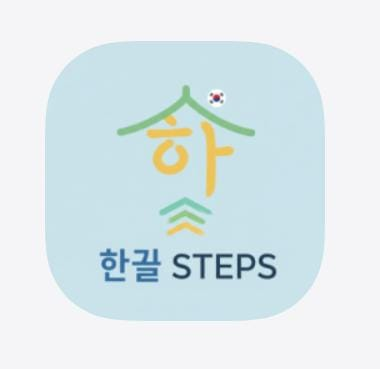
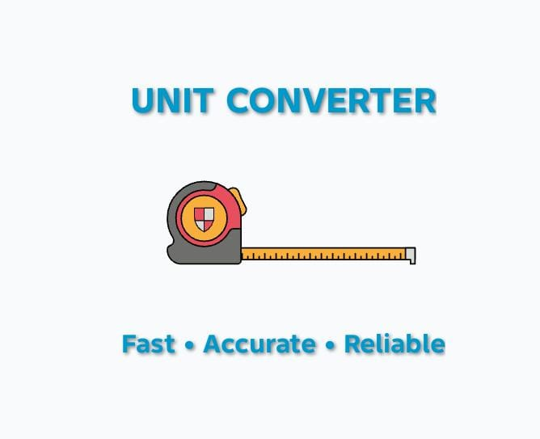

# Maheen Ghulam Muhaammaad 👨‍💻

  

  

  

## Hero

I’m a developer focused on building thoughtful digital experiences through Android apps, modern frontend design, and polished product thinking. I care about clarity, aesthetics, and solving real problems with code.

## Neon Stack

## Featured Projects

  <table>
    <tr>
      <td align="center">
        
         <strong><a href="https://github.com/MaheenGM/KL">KL App</a></strong>
         A Korean learning Android app with structured lessons, vocabulary practice, and progress tracking.
      </td>
      <td align="center">
        
         <strong><a href="https://github.com/MaheenGM/Unit-Converter-App">Unit Converter App</a></strong>
         A powerful utility for converting between multiple units and measurement systems.
      </td>
      <td align="center">
        
         <strong><a href="https://github.com/MaheenGM/transcript-attestation-verification-system">Transcript Attestation</a></strong>
         A verification system for managing and attesting academic transcript records.
      </td>
    </tr>
  </table>

## GitHub Analytics

  

  

  

## Learning Focus

- Advanced Android architecture
- Better UI/UX systems
- Scalable, production-ready software design

## Connect

- GitHub: https://github.com/MaheenGM
- LinkedIn: https://www.linkedin.com/in/maheen-gm-627710336
- Portfolio: https://github.com/MaheenGM
- Email: imaheenghulam@example.com
